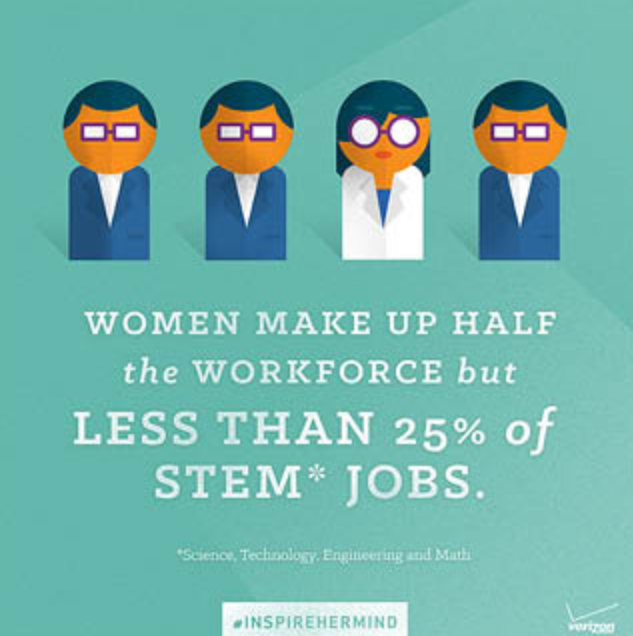
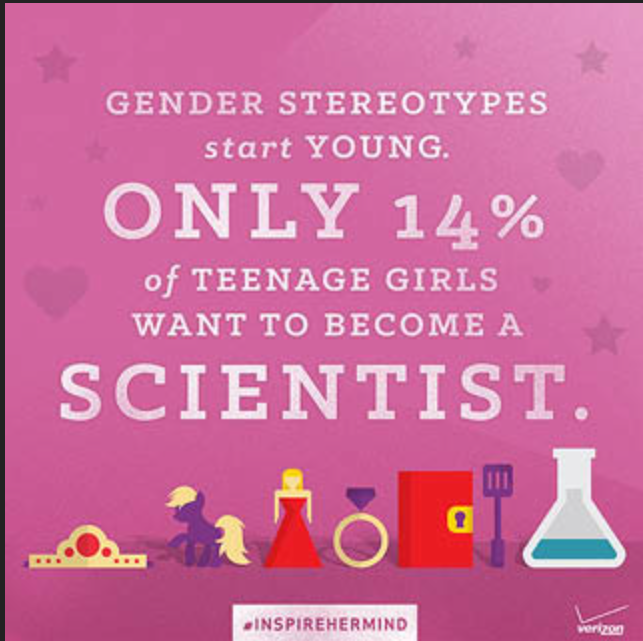

<html>
<head>
  <meta charset="utf-8"/>
  <link rel="stylesheet" href="https://maxcdn.bootstrapcdn.com/bootstrap/3.3.6/css/bootstrap.min.css" integrity="sha384-1q8mTJOASx8j1Au+a5WDVnPi2lkFfwwEAa8hDDdjZlpLegxhjVME1fgjWPGmkzs7" crossorigin="anonymous">
  <link href='https://fonts.googleapis.com/css?family=Roboto:300,400,700' rel='stylesheet' type='text/css'>
  <link rel="stylesheet" type="text/css" href="main.css">
</head>
<body>
  <header class="container">
    

      
Home

      <nav class="col-sm-8 text-right">
        <a href="https://aquabs.github.io/STEM-clubs/">
Clubs
</a>
        <a href=" https://aquabs.github.io/STEM-events/. ">
Events
</a>
        <a href="https://aquabs.github.io/STEM-news/">
News
</a>
        <a href=" https://aquabs.github.io/STEM-contacts/. ">
Contact
</a>
      </nav>
    

  </header>
  <body>
  <section class="container">
    

      <figure class="col-sm-12">
      </figure>
    
  
</section><section class="container">
    

<figure class="col-sm-4 text-center">
        <h2 class="ex1">Workplace Discrepancy</h2>
         

</figure>
       <figure class="col-sm-4 text-center">
         <h2 class="ex1">Empowerment</h2>
           
      </figure>
       <figure class="col-sm-4 text-center">
        <h2 class="ex1">Destroying Social Stigmas</h2>
           
      </figure>
  

    </section>
      <section class="container">
        

          <figure class="col-sm-6">
            
          </figure>
          <figure class="col-sm-6">
            
March 22, 1972

            
The Equal Rights Ammendment for Women

            
   It's been almost 50 years since women were granted legal equality and protection from gender discrimination. Yet, we are still struggling with equal participation of girls among STEM feilds...

            
Why!?

            <ul style="font-sze: 250%;">
              <li>Societal Pressures and Stigmas</li>
              <li>Lack of Encouragement</li>
              <li>Childcare</li>
              <li>Marginalization</li>
            </ul>
            
 

            
LET'S CHANGE THAT!

          </figure>
    

        <section class="container">
          

            <figure class="col-sm-3">
                    
             </figure>
             <figure class="col-sm-3">
                    
             </figure>
            <figure class="col-sm-3">
                    
             </figure>
             <figure class="col-sm-3">
                    
             </figure>
          

        </section>
 
  <footer class="container">
    

      
&copy; STEM Camas

      <ul class="col-sm-8">
        <li class="col-sm-1">   </li>
        <li class="col-sm-1">  </li>
      </ul>
    

  </footer>
  

</body>
</html>

     

